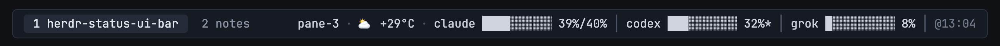
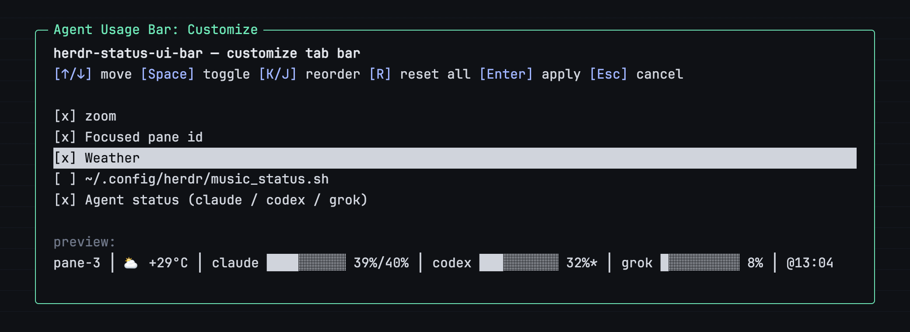

# herdr-status-ui-bar

Plan-usage gauges for your AI coding agents — **Claude Code, OpenAI Codex, and Grok CLI** — rendered in the [herdr](https://herdr.dev) tab bar, plus a popup to customize the whole tab bar's layout.



```
⛅ +29°C · claude ████░░░░░░ 39%/40% │ codex ███░░░░░░░ 32%* │ grok █░░░░░░░░░ 8% │ @13:04
```

- `claude 5h%/7d%` — Claude Code rate-limit windows, captured passively from your statusline (no network, no credentials)
- `codex 30d%` — read locally from `~/.codex/sessions` rollout logs
- `grok credit%` — one lightweight call to the Grok CLI billing API, cached with graceful fallback
- gauge = 10 cells (10% each); ` │ ` separates each agent segment (also before the timestamp)
- `@HH:MM` — when the data was read (the widget refreshes every 5 minutes) · `*` — the source data is stale
- Segments for agents you don't use are silently omitted. Zero external dependencies beyond python3 (3.9+) and curl.

## Install

As a herdr plugin (herdr 0.8+) — this is **two steps**. `plugin install` only *registers* the
plugin; it does **not** touch your config. You then run the plugin's **install action**, which is
what actually adds the widget and (if applicable) wraps your Claude statusline:

```
# 1. register the plugin
herdr plugin install speardragon/herdr-status-ui-bar

# 2. run the install action (this is the step that adds the tab-bar widget)
herdr plugin action invoke speardragon.herdr-status-ui-bar.install
```

If the widget doesn't appear after `plugin install` alone, you almost certainly skipped step 2 —
`plugin install` never runs actions on its own.

> Note: with `herdr plugin install`, the `--yes` flag must come **after** the source
> (`herdr plugin install speardragon/herdr-status-ui-bar --yes`). Putting `--yes`/`-y` *before*
> the source prints a `usage:` error. Without `--yes`, an interactive terminal shows a preview of
> the source and the commands it will run, so you can review before confirming.

You can confirm the plugin registered and see its action ids with:

```
herdr plugin list
herdr plugin action list --plugin speardragon.herdr-status-ui-bar
```

Or install directly, without the plugin system:

```
git clone https://github.com/speardragon/herdr-status-ui-bar && cd herdr-status-ui-bar && ./install.sh
```

To skip wrapping your Claude Code statusline (widget still runs, just without the claude segment): `AGENT_USAGE_SKIP_CLAUDE=1 ./install.sh`

What `install.sh` does (idempotent; anything it touches is backed up as `*.bak-agent-usage-<timestamp>`):

1. copies the widget scripts to `~/.config/herdr/agent-usage/`
2. builds (or updates) `~/.config/herdr/agent-usage/layout.toml` — see [Customize the tab bar](#customize-the-tab-bar) — and regenerates `[ui].tab_bar_right` in your herdr `config.toml` from it
3. if you have a Claude Code statusline, wraps it to capture rate-limit data — your original command is preserved as a sidecar and still renders exactly as before

## Customize the tab bar

This plugin owns `[ui].tab_bar_right` entirely — it's always regenerated from
`~/.config/herdr/agent-usage/layout.toml`, in order. Three blocks come built in:

| Block | Shows | Options |
|---|---|---|
| `agent-status` | the gauges described above | — |
| `weather` | `curl`'d from [wttr.in](https://wttr.in) | `city` (default `Seoul`) |
| `herdr-tab-id` | the focused pane id (`herdr api snapshot`, parsed in Python — no `jq`) | — |

Open the popup editor:

```
herdr plugin action invoke speardragon.herdr-status-ui-bar.customize
```



In the popup: `↑/↓` or `k/j` to move, `Space` to toggle a block on/off, `K`/`J`
(shift+k / shift+j) to reorder, `R` (shift+r) to turn everything off, `Enter` to
apply (rewrites `config.toml` and reloads herdr), `Esc`/`q` to cancel without
changing anything. A live preview line at the bottom runs each enabled block's
actual command so you can see the result before committing.

To clear the tab bar without opening the popup:

```
herdr plugin action invoke speardragon.herdr-status-ui-bar.reset
```

This only flips every block to disabled in `layout.toml` — reopen the popup to turn any of them back on.

On first install, any widgets already in your `tab_bar_right` are carried over: entries that
exactly match one of the built-in blocks (weather commands may differ only by city) are promoted
to that block; everything else — `zoom`, a custom script, a hand-written command — is kept as-is
in a `custom` block so nothing you had is lost, just reordered/toggled through the same popup.
Options beyond `city` and `interval_seconds`/`timeout_seconds` per block aren't exposed in the
popup yet — edit `layout.toml` by hand for those.

## Data sources

Fetching approach credits: [CodexBar](https://github.com/steipete/CodexBar)

| Agent | Source | Locality | Updated when |
|---|---|---|---|
| Claude Code | statusline capture file | local | every statusline render (live while you use Claude Code) |
| Codex | `~/.codex/sessions` rollout logs (JSONL) | local | whenever the Codex CLI writes a session |
| Grok | CLI-proxy billing REST, one call | network | each widget tick (5 min), cached on failure |

The Grok token is never passed as a curl argument — it's sent via stdin config (`-K -`), so it never shows up in `ps`. No credential is ever written to a log or to stdout.

## Notes & limitations

- As of herdr 0.8.x, the tab bar does not render ANSI escapes from command widgets, so output there is always plain text. `--color` exists for running the script directly in a terminal.
- If you've never used the Codex CLI, the codex segment is simply omitted (sessions are its only data source). A `*` means your most recent Codex session is older than 24 hours — use the CLI again and it clears.
- The claude segment requires an existing Claude Code statusline; without one it's simply omitted.
- Exotic `config.toml` layouts (for example, brackets inside a widget's command string) aren't handled by the installer's bracket-counting parser — it detects this, makes no changes, and prints instructions for adding the widget line by hand.

## Uninstall

Run the uninstall action (removes the `agent-status` widget and restores your original statusline).
Any other blocks you arranged with the `customize` popup — `weather`, `herdr-tab-id`, or carried-over
`custom` ones — are left in place and in the order you set, since those aren't this plugin's to remove.
If `herdr-tab-id` is still enabled, `tab_id.py` and `layout.toml` are kept so it keeps working; otherwise
`~/.config/herdr/agent-usage/` is removed entirely:

```
herdr plugin action invoke speardragon.herdr-status-ui-bar.uninstall
```

Or, for a direct install, run the script:

```
./uninstall.sh
```

Removing the plugin registration itself is separate from the uninstall action — run it after, if you also want to unregister:

```
herdr plugin uninstall speardragon/herdr-status-ui-bar
```

Backups (`*.bak-agent-usage-<timestamp>`) created by `install.sh` are left in place intentionally — uninstall does not delete them, so you can always recover a pre-install file by hand.

## License

MIT
